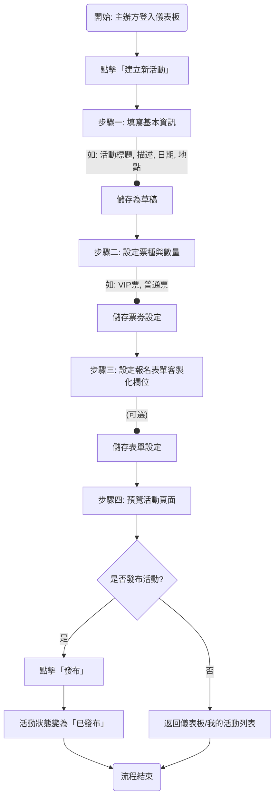

````markdown
# JCTOPV2 UI/UX Specification

## 1. 介紹 (Introduction)

本文件定義了 JCTOPV2 專案的使用者體驗目標、資訊架構、使用者流程和視覺設計規格。它將作為視覺設計和前端開發的基礎，確保在 Web、iOS 和 Android 平台上都有一致且以使用者為中心的體驗。

### 1.1 整體 UX 目標與原則 (Overall UX Goals & Principles)

#### 目標使用者輪廓 (Target User Personas)
* **活動主辦方 (Event Organizer):** 需要強大、易於操作的管理功能。
* **一般參加者 (General Attendee):** 追求流暢、簡單的活動發現與報名體驗。
* **平台方 (Platform Owner):** 需要最高權限，能夠監控整個平台的運作、管理使用者和內容。

#### 可用性目標 (Usability Goals)
* **學習效率:** 新的「參加者」能在 3 分鐘內完成從發現到註冊一個活動的流程。
* **操作效率:** 「主辦方」能在一分鐘內完成對一個已報名者的手動報到。
* **滿意度:** 應用程式在商店的評分目標是 4.5 顆星以上。

#### 核心設計原則 (Core Design Principles)
1.  **清晰至上 (Clarity First):** 介面應當不言自明，優先使用清晰、易於理解的佈局和文字。
2.  **體驗流暢 (Seamless Flow):** 透過流暢的轉場和即時的系統反饋，打造無縫的使用體驗。
3.  **賦予掌控 (Empowerment & Control):** 為主辦方和平台方提供強大而直觀的工具。
4.  **保持一致 (Consistency is Key):** 在整個應用程式中，使用一致的元件、術語和互動模式。
5.  **美感與實用兼具 (Aesthetic & Functional):** 追求視覺上令人愉悅且功能上可用的設計。

---

## 2. 資訊架構 (Information Architecture, IA)

#### 網站地圖 / 畫面清單 (Site Map / Screen Inventory)
```mermaid
graph TD
    subgraph Unauthenticated (未登入)
        A[登入/註冊頁] --> A1[忘記密碼流程]
    end
    subgraph Attendee (一般參加者)
        B[主畫面/活動發現] --> C[活動詳情頁]
        B --> D[我的儀表板]
        C --> E[活動報名流程]
        D --> D1[我的票券]
        D --> D2[我的最愛]
        D --> D3[個人資料管理]
        E --> F[付款流程]
        F --> G[報名成功確認頁]
    end
    subgraph Organizer (活動主辦方)
        H[主辦方儀表板] --> I[建立/編輯活動]
        H --> J[我的活動列表]
        J --> K[活動參加者管理]
        J --> L[活動報到模式]
        J --> M[活動分析報告]
        H --> N[折扣碼管理]
    end
    subgraph Platform Owner (平台方)
        P[平台管理後台] --> P1[使用者管理]
        P --> P2[活動內容審核]
        P --> P3[全站數據分析]
    end
    A --> B
    A --> H
````

#### 導航結構 (Navigation Structure)

  * **參加者導航:** 行動裝置上使用**底部標籤導航列 (Bottom Tab Bar)**；網頁版上轉換為**頂部導航列或側邊欄 (Top Nav/Sidebar)**。
  * **主辦方/平台方導航:** 使用**側邊選單 (Side Drawer)**，在行動裝置上為「漢堡選單」，在網頁版上為固定側邊欄。

-----

## 3\. 使用者流程 (User Flows)

#### 流程 1: 一般參加者探索並報名活動

```mermaid
graph TD
    A(開始: 開啟應用) --> B{是否已登入?}
    B -- 否 --> C[登入/註冊頁]
    C --> D[輸入帳號資訊]
    D --> E[登入成功]
    B -- 是 --> E
    E --> F[瀏覽活動發現頁]
    F --> G[點擊感興趣的活動]
    G --> H[進入活動詳情頁]
    H --> I[點擊「立即報名」]
    I --> J[選擇票種與數量]
    J --> K[填寫報名資料/輸入折扣碼]
    K --> L[前往付款]
    L --> M[完成付款]
    M --> N[看到報名成功確認頁]
    N --> O[在「我的票券」中看到新票券]
    O --> P(流程結束)
```

#### 流程 2: 活動主辦方建立新活動



-----

## 4\. 線框圖與模型 (Wireframes & Mockups)

#### 設計方式 (Design Approach)

  * 我們將採用**AI 輔助生成 (AI-Assisted Generation)** 的路徑。本規格書將用於生成一份給 Vercel v0 或類似工具的 Master Prompt，以快速產出高擬真度的設計原型與程式碼。

#### 佈局概念範例: 活動詳情頁

```
+-------------------------------------------+
| [活動主圖 (Event Hero Image)]             |
+-------------------------------------------+
|                                           |
| # 活動標題 (Event Title)                  |
| 🗓️ 日期與時間 (Date & Time)                |
| 📍 地點 (Location)                         |
| 👤 主辦方資訊 (Organizer Info)             |
|                                           |
| --- (分隔線) ---                          |
|                                           |
| ## 關於活動 (About the Event)             |
| [詳細描述內文...]                         |
|                                           |
| ## 票種 (Ticket Types)                    |
| - [普通票: $500 (剩餘: 87)]              |
| - [VIP 票: $1500 (剩餘: 12)]             |
|                                           |
| ## 地圖 (Map)                             |
| [嵌入式地圖區塊]                          |
|                                           |
| ## 分享 (Share)                           |
| [FB Icon] [LINE Icon] [Copy Link Icon]    |
|                                           |
+-------------------------------------------+
| [立即報名 (Register Now CTA Button)]      |
+-------------------------------------------+
```

-----

## 5\. 元件庫 (Component Library)

#### 核心元件 (Core Components)

  * **Button (按鈕):**
      * **變體:** `primary`, `secondary`, `text`
      * **狀態:** `default`, `pressed`, `disabled`
  * **Input (輸入框):**
      * **變體:** `default`, `outlined`
      * **狀態:** `default`, `focused`, `error`, `disabled`
      * **包含:** `Label`, `Placeholder`, `Helper Text`, `Error Message`
  * **Card (卡片):**
      * **用途:** 展示活動等獨立內容區塊。
      * **樣式:** 圓角、陰影、淺灰背景。
      * **狀態:** `default`, `pressed`, `hover` (網頁版)。

-----

## 6\. 品牌與風格指南 (Branding & Style Guide)

#### 色彩方案 (Color Palette)

| 色彩類型 | Hex 色碼 | 建議用途 |
| :--- | :--- | :--- |
| **主色 (Primary)** | `#007BFF` | 主要按鈕、活動元素、連結 |
| **純白 (White)** | `#FFFFFF` | 主要頁面背景 |
| **淺灰 (Light Grey)** | `#F8F9FA` | 卡片、區塊背景 |
| **中灰 (Mid Grey)** | `#6C757D` | 次要文字、停用狀態 |
| **深黑 (Dark)** | `#212529` | 主要標題和內文 |
| **成功 (Success)** | `#28A745` | 成功提示 |
| **危險 (Danger)** | `#DC3545` | 錯誤訊息 |
| **警告 (Warning)** | `#FFC107` | 警告提示 |

#### 字體排印 (Typography)

  * **字體家族:** 採用**系統預設字體**。iOS 上會自動使用 **蘋方-繁 (PingFang TC)**；Android 上會自動使用 **思源黑體-繁 (Noto Sans CJK TC)**，以確保繁體中文的最佳顯示效果與效能。
  * **字體層級:** H1 (24pt, Bold), H2 (20pt, Bold), Body (16pt, Regular), Small (14pt, Regular)。

#### 圖示庫 (Iconography)

  * **圖示庫:** 使用 `@expo/vector-icons`。
  * **主要風格:** `Material Community Icons`。

#### 間距與佈局 (Spacing & Layout)

  * 採用 **8pt 網格系統** 作為佈局基礎。

-----

## 7\. 無障礙設計 (Accessibility)

  * **合規目標:** **WCAG 2.1 AA 級別**。
  * **關鍵需求:** 確保足夠的色彩對比度、清晰的焦點指示、完整的鍵盤操作支援、足夠大的觸控目標、為圖片提供替代文字、為表單提供標籤。
  * **測試策略:** 開發中採用自動化工具掃描，關鍵流程輔以手動測試。

-----

## 8\. 響應式策略 (Responsiveness Strategy)

  * **中斷點 (Breakpoints):** Mobile (\< 768px), Tablet (≥ 768px), Desktop (≥ 1200px)。
  * **適應模式 (Adaptation Patterns):**
      * **佈局:** 行動裝置為單欄，較大螢幕為多欄。
      * **導航:** 行動裝置為底部標籤導航，網頁版為頂部或側邊導航。
      * **內容:** 小螢幕優先顯示核心內容，次要資訊可收合。
      * **互動:** 滑鼠懸停效果僅限網頁版。

<!-- end list -->