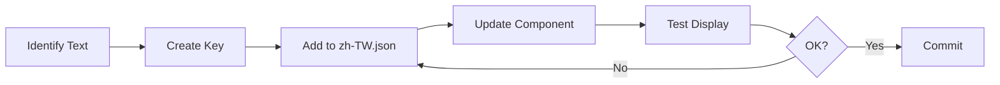

# Localization Guide - i18n Implementation

## Overview

This guide documents the localization system implementation using i18next and react-i18next in the JCTOPV2 project. The application primarily uses Traditional Chinese (繁體中文) with full internationalization support.

## Setup and Configuration

### Installation

```bash
npm install i18next react-i18next
```

### Initialization

Configuration file: `apps/client/src/localization/index.ts`

```typescript
import i18n from 'i18next';
import { initReactI18next } from 'react-i18next';
import zhTW from './locales/zh-TW.json';

i18n
  .use(initReactI18next)
  .init({
    compatibilityJSON: 'v3',
    resources: {
      'zh-TW': {
        translation: zhTW,
      },
    },
    lng: 'zh-TW',
    fallbackLng: 'zh-TW',
    interpolation: {
      escapeValue: false,
    },
    react: {
      useSuspense: false,
    },
  });

export default i18n;
```

### App Integration

In `App.tsx`:

```tsx
import './src/localization';
import { I18nextProvider } from 'react-i18next';
import i18n from './src/localization';

export default function App() {
  return (
    <I18nextProvider i18n={i18n}>
      <ThemeProvider theme={theme}>
        {/* Your app content */}
      </ThemeProvider>
    </I18nextProvider>
  );
}
```

## Translation File Structure

### File Location
`apps/client/src/localization/locales/zh-TW.json`

### Organization Pattern

```json
{
  "common": {
    "yes": "是",
    "no": "否",
    "confirm": "確認",
    "cancel": "取消",
    "save": "儲存",
    "delete": "刪除",
    "edit": "編輯",
    "search": "搜尋",
    "loading": "載入中...",
    "error": "錯誤",
    "success": "成功",
    "warning": "警告"
  },
  "auth": {
    "login": "登入",
    "logout": "登出",
    "register": "註冊",
    "forgotPassword": "忘記密碼",
    "resetPassword": "重設密碼",
    "email": "電子郵件",
    "password": "密碼",
    "confirmPassword": "確認密碼",
    "rememberMe": "記住我",
    "loginSuccess": "登入成功",
    "loginError": "登入失敗，請檢查您的帳號密碼"
  },
  "event": {
    "title": "活動名稱",
    "description": "活動描述",
    "date": "活動日期",
    "time": "活動時間",
    "location": "活動地點",
    "price": "票價",
    "availableTickets": "剩餘票數",
    "register": "立即報名",
    "soldOut": "已售完",
    "upcoming": "即將開始",
    "ongoing": "進行中",
    "ended": "已結束"
  },
  "payment": {
    "total": "總計",
    "subtotal": "小計",
    "discount": "折扣",
    "tax": "稅額",
    "paymentMethod": "付款方式",
    "creditCard": "信用卡",
    "bankTransfer": "銀行轉帳",
    "cashOnDelivery": "貨到付款",
    "payNow": "立即付款",
    "paymentSuccess": "付款成功",
    "paymentFailed": "付款失敗"
  },
  "validation": {
    "required": "此欄位為必填",
    "email": "請輸入有效的電子郵件地址",
    "minLength": "最少需要 {{min}} 個字元",
    "maxLength": "最多只能有 {{max}} 個字元",
    "passwordMatch": "密碼不相符",
    "phoneNumber": "請輸入有效的電話號碼",
    "invalidFormat": "格式不正確"
  },
  "navigation": {
    "home": "首頁",
    "events": "活動",
    "tickets": "我的票券",
    "profile": "個人資料",
    "settings": "設定",
    "help": "幫助",
    "about": "關於"
  },
  "ticket": {
    "myTickets": "我的票券",
    "ticketType": "票種",
    "quantity": "數量",
    "ticketNumber": "票券編號",
    "qrCode": "QR Code",
    "showQRCode": "顯示 QR Code",
    "ticketDetails": "票券詳情",
    "refund": "退票",
    "transfer": "轉讓"
  },
  "organizer": {
    "dashboard": "管理後台",
    "createEvent": "建立活動",
    "myEvents": "我的活動",
    "attendees": "參加者管理",
    "analytics": "數據分析",
    "revenue": "收益報表",
    "checkIn": "報到",
    "export": "匯出"
  },
  "errors": {
    "networkError": "網路連線錯誤，請稍後再試",
    "serverError": "伺服器錯誤，請聯繫客服",
    "notFound": "找不到您要的內容",
    "unauthorized": "您沒有權限執行此操作",
    "sessionExpired": "您的登入已過期，請重新登入",
    "unknown": "發生未知錯誤"
  },
  "date": {
    "today": "今天",
    "tomorrow": "明天",
    "yesterday": "昨天",
    "days": "天",
    "hours": "小時",
    "minutes": "分鐘",
    "seconds": "秒",
    "ago": "前",
    "later": "後"
  }
}
```

## Translation Key Naming Conventions

### Naming Rules

1. **Use lowercase with camelCase**
   ```json
   "loginButton": "登入按鈕"  ✅
   "LoginButton": "登入按鈕"  ❌
   "login_button": "登入按鈕" ❌
   ```

2. **Group by feature/context**
   ```json
   "auth.login": "登入"
   "auth.logout": "登出"
   "event.create": "建立活動"
   "event.edit": "編輯活動"
   ```

3. **Use descriptive names**
   ```json
   "auth.loginSuccessMessage": "登入成功" ✅
   "auth.msg1": "登入成功" ❌
   ```

4. **Action naming pattern**
   ```json
   "button.save": "儲存"
   "title.eventList": "活動列表"
   "message.confirmDelete": "確定要刪除嗎？"
   "label.emailAddress": "電子郵件地址"
   ```

## Usage in Components

### Basic Usage

```tsx
import { useTranslation } from 'react-i18next';

const MyComponent = () => {
  const { t } = useTranslation();

  return (
    <View>
      <Text>{t('common.welcome')}</Text>
      <Button title={t('auth.login')} />
    </View>
  );
};
```

### With Interpolation

```tsx
const ProfileScreen = () => {
  const { t } = useTranslation();
  const userName = 'John';
  const count = 5;

  return (
    <View>
      {/* Simple interpolation */}
      <Text>{t('welcome.user', { name: userName })}</Text>
      {/* Output: 歡迎，John！ */}

      {/* Count interpolation */}
      <Text>{t('event.ticketsLeft', { count })}</Text>
      {/* Output: 剩餘 5 張票 */}
    </View>
  );
};

// Translation file:
{
  "welcome": {
    "user": "歡迎，{{name}}！"
  },
  "event": {
    "ticketsLeft": "剩餘 {{count}} 張票"
  }
}
```

### Nested Translations

```tsx
const EventCard = () => {
  const { t } = useTranslation();

  return (
    <Card>
      <Text>{t('event.details.title')}</Text>
      <Text>{t('event.details.description')}</Text>
      <Text>{t('event.status.upcoming')}</Text>
    </Card>
  );
};
```

## Traditional Chinese Formatting Rules

### Date and Time Formatting

```typescript
import { format } from 'date-fns';
import { zhTW } from 'date-fns/locale';

// Date formats
const formatDate = (date: Date) => {
  return format(date, 'yyyy年MM月dd日', { locale: zhTW });
  // Output: 2025年08月14日
};

const formatDateTime = (date: Date) => {
  return format(date, 'yyyy年MM月dd日 HH:mm', { locale: zhTW });
  // Output: 2025年08月14日 14:30
};

const formatTime = (date: Date) => {
  return format(date, 'HH:mm', { locale: zhTW });
  // Output: 14:30
};

// Relative time
const formatRelativeTime = (date: Date) => {
  const now = new Date();
  const diff = now.getTime() - date.getTime();
  const days = Math.floor(diff / (1000 * 60 * 60 * 24));
  
  if (days === 0) return '今天';
  if (days === 1) return '昨天';
  if (days === -1) return '明天';
  if (days < 7 && days > 0) return `${days} 天前`;
  if (days > -7 && days < 0) return `${Math.abs(days)} 天後`;
  
  return formatDate(date);
};
```

### Currency Formatting

```typescript
// Currency formatter for TWD
const formatCurrency = (amount: number): string => {
  return new Intl.NumberFormat('zh-TW', {
    style: 'currency',
    currency: 'TWD',
    minimumFractionDigits: 0,
    maximumFractionDigits: 0,
  }).format(amount);
};

// Examples:
formatCurrency(500)    // NT$500
formatCurrency(1500)   // NT$1,500
formatCurrency(99999)  // NT$99,999
```

### Number Formatting

```typescript
// Number formatter
const formatNumber = (num: number): string => {
  return new Intl.NumberFormat('zh-TW').format(num);
};

// Examples:
formatNumber(1000)     // 1,000
formatNumber(1000000)  // 1,000,000

// Percentage
const formatPercentage = (num: number): string => {
  return new Intl.NumberFormat('zh-TW', {
    style: 'percent',
    minimumFractionDigits: 0,
    maximumFractionDigits: 1,
  }).format(num);
};

// Examples:
formatPercentage(0.85)   // 85%
formatPercentage(0.333)  // 33.3%
```

### Phone Number Formatting

```typescript
// Taiwan phone number format
const formatPhoneNumber = (phone: string): string => {
  // Remove all non-digits
  const cleaned = phone.replace(/\D/g, '');
  
  // Mobile: 0912-345-678
  if (cleaned.startsWith('09') && cleaned.length === 10) {
    return `${cleaned.slice(0, 4)}-${cleaned.slice(4, 7)}-${cleaned.slice(7)}`;
  }
  
  // Landline with area code: (02) 1234-5678
  if (cleaned.length === 9 || cleaned.length === 10) {
    const areaCode = cleaned.slice(0, 2);
    const rest = cleaned.slice(2);
    if (rest.length === 7) {
      return `(${areaCode}) ${rest.slice(0, 3)}-${rest.slice(3)}`;
    }
    if (rest.length === 8) {
      return `(${areaCode}) ${rest.slice(0, 4)}-${rest.slice(4)}`;
    }
  }
  
  return phone; // Return original if no match
};
```

## Pluralization Rules for Traditional Chinese

Traditional Chinese doesn't have complex pluralization like English. However, we handle counting patterns:

```json
{
  "ticket": {
    "count_zero": "沒有票券",
    "count_one": "{{count}} 張票券",
    "count_other": "{{count}} 張票券"
  }
}
```

Usage:
```tsx
const { t } = useTranslation();

// Will automatically select the right translation
t('ticket.count', { count: 0 });  // 沒有票券
t('ticket.count', { count: 1 });  // 1 張票券
t('ticket.count', { count: 5 });  // 5 張票券
```

## Adding New Translations

### Process

1. **Identify the text to translate**
   ```tsx
   // Before (hardcoded)
   <Text>Welcome to our app</Text>
   
   // Identify key structure
   // Section: common
   // Key: welcomeMessage
   ```

2. **Add to translation file**
   ```json
   // locales/zh-TW.json
   {
     "common": {
       "welcomeMessage": "歡迎使用我們的應用程式"
     }
   }
   ```

3. **Update component**
   ```tsx
   // After
   const { t } = useTranslation();
   <Text>{t('common.welcomeMessage')}</Text>
   ```

4. **Test the translation**
   - Verify text displays correctly
   - Check for text overflow
   - Test with different screen sizes

### Translation Workflow



## Translation Completeness Checklist

### Component Translation Checklist

- [ ] All static text uses t() function
- [ ] No hardcoded Chinese text in components
- [ ] Error messages are translated
- [ ] Success messages are translated
- [ ] Placeholder text is translated
- [ ] Button labels are translated
- [ ] Navigation titles are translated
- [ ] Alert/Modal content is translated
- [ ] Form labels are translated
- [ ] Validation messages are translated

### Screen Translation Checklist

For each screen, verify:
- [ ] Screen title is translated
- [ ] All labels are translated
- [ ] Help text is translated
- [ ] Empty state messages are translated
- [ ] Loading messages are translated
- [ ] Error states are translated

### Testing Checklist

- [ ] Text displays correctly
- [ ] No text overflow issues
- [ ] Correct date/time format
- [ ] Correct currency format
- [ ] Correct number format
- [ ] Accessibility labels are translated

## Common Patterns

### Form Validation Messages

```typescript
const getValidationMessage = (field: string, rule: string, params?: any) => {
  const { t } = useTranslation();
  
  switch (rule) {
    case 'required':
      return t('validation.required');
    case 'email':
      return t('validation.email');
    case 'minLength':
      return t('validation.minLength', { min: params.min });
    case 'maxLength':
      return t('validation.maxLength', { max: params.max });
    default:
      return t('validation.invalidFormat');
  }
};
```

### Dynamic Content

```typescript
// For API content that might not be translated
const getEventStatus = (status: string) => {
  const { t } = useTranslation();
  
  const statusMap = {
    'upcoming': t('event.status.upcoming'),
    'ongoing': t('event.status.ongoing'),
    'ended': t('event.status.ended'),
    'cancelled': t('event.status.cancelled'),
  };
  
  return statusMap[status] || status;
};
```

### Date Display

```typescript
const EventDate = ({ date }: { date: string }) => {
  const { i18n } = useTranslation();
  const locale = i18n.language === 'zh-TW' ? zhTW : enUS;
  
  return (
    <Text>
      {format(new Date(date), 'PPP', { locale })}
    </Text>
  );
};
```

## Performance Optimization

### Lazy Loading Translations

```typescript
// For large translation files, split by feature
const resources = {
  'zh-TW': {
    common: () => import('./locales/zh-TW/common.json'),
    auth: () => import('./locales/zh-TW/auth.json'),
    event: () => import('./locales/zh-TW/event.json'),
    payment: () => import('./locales/zh-TW/payment.json'),
  },
};
```

### Memoization

```tsx
import { memo } from 'react';

// Memoize components that use translations
const TranslatedComponent = memo(({ messageKey }) => {
  const { t } = useTranslation();
  return <Text>{t(messageKey)}</Text>;
});
```

## Debugging Tips

### Check Missing Translations

```typescript
// In development, log missing translations
i18n.on('missingKey', (lng, namespace, key) => {
  console.warn(`Missing translation: ${lng}/${namespace}/${key}`);
});
```

### Translation Inspector

```typescript
// Development tool to show translation keys
const DEBUG_I18N = __DEV__;

const DebugText = ({ tKey, ...props }) => {
  const { t } = useTranslation();
  
  if (DEBUG_I18N) {
    return (
      <Text {...props}>
        {t(tKey)} [{tKey}]
      </Text>
    );
  }
  
  return <Text {...props}>{t(tKey)}</Text>;
};
```

---

*Last Updated: 2025-08-14*
*Version: 1.0.0*