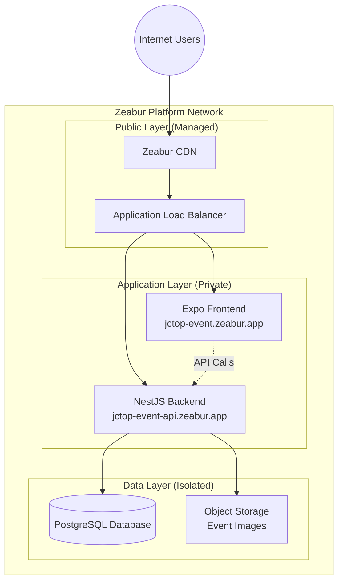

# JCTOP Event Management Platform Infrastructure Architecture

## Infrastructure Overview

- **Cloud Provider:** Zeabur (Platform-as-a-Service) with managed infrastructure
- **Core Services & Resources:** 
  - Managed PostgreSQL database
  - Zeabur Object Storage (S3-compatible) for event images
  - Managed CI/CD pipeline
  - Built-in monitoring and logging
- **Regional Architecture:** Single-region deployment with Zeabur's managed infrastructure
- **Multi-environment Strategy:** Development (local), Staging (develop branch), Production (main branch)

## Infrastructure as Code (IaC)

- **Tools & Frameworks:** 
  - Zeabur deployment configuration files
  - Docker containerization for service packaging
  - Environment-specific configuration through Zeabur dashboard
  - Database migrations managed through NestJS/TypeORM
- **Repository Structure:** 
  - `/apps/server/` - Backend service configuration
  - `/apps/client/` - Frontend build configuration  
  - `/docker/` - Container definitions
  - Environment configurations managed in Zeabur platform
- **State Management:** 
  - Zeabur platform manages infrastructure state
  - Application state managed through Git repository
  - Database schema versioning through migration files
- **Dependency Management:**
  - Monorepo dependency management through package.json
  - Service dependencies declared in Zeabur configuration
  - Database dependencies managed through TypeORM relationships

<critical_rule>All infrastructure must be defined as code. No manual resource creation in production environments.</critical_rule>

## Environment Configuration

- **Environment Promotion Strategy:**
  - **Local Development** → **Staging** (develop branch) → **Production** (main branch)
  - Automated promotion through Git-driven deployments
  - Each environment maintains identical service architecture
  - Progressive validation through staging before production deployment
- **Configuration Management:**
  - Environment-specific variables managed in Zeabur platform
  - Shared configuration through monorepo environment files
  - Database connection strings and API keys managed as Zeabur secrets
  - Feature flags integrated through application-level configuration
- **Secret Management:**
  - Zeabur platform secret management for sensitive data
  - ECPay API credentials stored as encrypted environment variables
  - Database passwords and connection strings managed by platform
  - API keys for third-party services (mapping, notifications) secured in platform
- **Feature Flag Integration:**
  - Application-level feature toggles for gradual rollouts
  - Environment-specific feature sets for testing new event management features
  - A/B testing capabilities for payment flow optimization

### **Development Environment**
- **Purpose:** Local development and testing
- **Resources:** Local containers, local PostgreSQL, local object storage simulation
- **Access Control:** Developer workstation access only
- **Data Classification:** Synthetic test data, no PII

### **Staging Environment**  
- **Purpose:** Pre-production testing and QA validation
- **Resources:** Managed PostgreSQL, Zeabur Object Storage, full service stack
- **Access Control:** Development team and QA team access
- **Data Classification:** Anonymized production-like data for testing

### **Production Environment**
- **Purpose:** Live event management platform serving end users
- **Resources:** Production-grade managed PostgreSQL, Zeabur Object Storage, monitoring
- **Access Control:** Restricted to platform administrators and on-call engineers
- **Data Classification:** Live user data, PII, payment information

## Environment Transition Strategy

- **Development to Production Pipeline:**
  - **Local Development** → Git commit → **Feature Branch** → Pull Request → **Develop Branch** → **Staging Deployment** → Testing & QA → **Main Branch** → **Production Deployment**
  - Automated builds triggered on branch commits
  - Zero-downtime deployments through Zeabur's managed deployment strategy
- **Deployment Stages and Gates:**
  - **Build Stage:** TypeScript compilation, Docker image creation, dependency resolution
  - **Test Gate:** Jest unit tests, Supertest API tests, frontend component tests must pass
  - **Security Gate:** Dependency vulnerability scanning, secret detection validation
  - **Staging Gate:** Automated deployment to staging, smoke tests execution
  - **Manual QA Gate:** Human validation of event creation, registration, and payment flows
  - **Production Gate:** Manual approval required for main branch merge
- **Approval Workflows and Authorities:**
  - **Feature Branch → Develop:** Developer peer review required
  - **Develop → Staging:** Automatic deployment, no manual approval
  - **Staging → Production:** Technical lead or product owner approval required
  - **Hotfix Deployments:** Emergency approval process for critical production issues
- **Rollback Procedures:**
  - **Immediate Rollback:** Git revert to previous main branch commit
  - **Database Rollback:** TypeORM migration rollback procedures
  - **Storage Rollback:** Object storage versioning for event images
  - **Configuration Rollback:** Zeabur environment variable reversion
- **Change Cadence and Release Windows:**
  - **Regular Releases:** Weekly production deployments during low-traffic periods
  - **Hotfix Window:** 24/7 availability for critical bug fixes
  - **Maintenance Window:** Monthly scheduled maintenance for infrastructure updates
- **Environment-Specific Configuration Management:**
  - **Development:** Local environment variables and test database connections
  - **Staging:** Production-like configuration with test payment gateway integration
  - **Production:** Live configuration with ECPay production API and monitoring

## Network Architecture

- **VPC/VNET Design:**
  - Zeabur managed network infrastructure with platform-level isolation
  - Service-to-service communication within Zeabur's secure network fabric
  - Public internet access through Zeabur's managed load balancers and CDN
- **Subnet Strategy:**
  - Public subnet: Load balancers and CDN edge nodes (managed by Zeabur)
  - Private subnet: Application services (NestJS backend, database)
  - Isolated subnet: Database and storage services with restricted access
- **Security Groups & NACLs:**
  - Application-level security through Zeabur platform policies
  - Service mesh networking for inter-service communication
  - Database access restricted to application services only
- **Load Balancers & API Gateways:**
  - Zeabur managed application load balancer for frontend/backend routing
  - API gateway capabilities integrated into Zeabur platform
  - SSL/TLS termination at load balancer level
- **Service Mesh:** Not applicable - Zeabur platform handles service-to-service communication

### Network Topology Diagram

## Compute Resources

- **Container Strategy:**
  - Docker containerization for both frontend and backend services
  - Zeabur managed container orchestration and scaling
  - Container-based deployment for consistent environments across development, staging, and production
  - Multi-stage Docker builds for optimized container sizes
- **Serverless Architecture:**
  - Not applicable - Using containerized applications on Zeabur platform
  - Background job processing through container-based workers if needed
  - Event-driven scaling through Zeabur's container auto-scaling capabilities
- **VM/Instance Configuration:**
  - Zeabur managed compute instances with platform-optimized resource allocation
  - Automatic resource provisioning based on application demands
  - No direct VM management required - abstracted by Zeabur platform
- **Auto-scaling Approach:**
  - Horizontal auto-scaling based on CPU and memory utilization
  - Traffic-based scaling for event registration surge handling
  - Database connection pooling to handle concurrent user access
  - Automatic scale-down during low-traffic periods for cost optimization

## Data Resources

- **Database Deployment Strategy:**
  - Zeabur managed PostgreSQL 16 with automated backups and maintenance
  - Primary database for event data, user accounts, registrations, and payment records
  - Connection pooling through NestJS TypeORM for efficient database connections
  - Database schema versioning through TypeORM migrations
- **Backup & Recovery:**
  - Automated daily backups with 30-day retention through Zeabur platform
  - Point-in-time recovery capabilities for data corruption scenarios
  - Weekly backup verification and restoration testing
  - Database export capabilities for disaster recovery scenarios
- **Replication & Failover:**
  - Zeabur managed database replication for high availability
  - Automated failover to replica during primary database maintenance
  - Read replica configuration for reporting and analytics queries
  - Cross-region backup storage for additional data protection
- **Data Migration Strategy:**
  - TypeORM migrations for schema evolution and data transformations
  - Staged migration approach: development → staging → production
  - Rollback capabilities for failed migrations with data integrity checks
  - Large data migration strategies for event and user data scaling

## Security Architecture

- **IAM & Authentication:**
  - Passport.js authentication middleware with local and federated (Google) authentication
  - JWT token-based authentication with refresh token rotation
  - Role-based access control (RBAC) for event organizers, attendees, and administrators
  - Multi-factor authentication support for administrative accounts
- **Network Security:**
  - Zeabur platform network isolation with managed firewall rules
  - HTTPS/TLS 1.3 enforcement for all client-server communications
  - API rate limiting and DDoS protection through Zeabur platform
  - Content Security Policy (CSP) headers for XSS protection
- **Data Encryption:**
  - Database encryption at rest through Zeabur managed PostgreSQL
  - Payment data encryption using industry-standard AES-256 encryption
  - Sensitive environment variables encrypted in Zeabur platform
  - Object storage encryption for event images and documents
- **Compliance Controls:**
  - PCI DSS compliance considerations for payment data handling
  - GDPR compliance for user data privacy and consent management
  - Data retention policies for user accounts and payment records
  - Audit logging for sensitive operations and administrative access
- **Security Scanning & Monitoring:**
  - Automated dependency vulnerability scanning in CI/CD pipeline
  - Container image security scanning before deployment
  - Real-time security monitoring and incident alerting
  - Regular penetration testing and security assessments

<critical_rule>Apply principle of least privilege for all access controls. Document all security exceptions with business justification.</critical_rule>

## Shared Responsibility Model

| Component | Cloud Provider (Zeabur) | Platform Team | Dev Team | Security Team |
|-----------|-------------------------|---------------|----------|---------------|
| **Physical Security** | ✓ | - | - | Audit |
| **Infrastructure Management** | ✓ | Config | - | Review |  
| **Platform Security** | ✓ | Config | - | Audit |
| **Network Security** | Partial | ✓ | Config | Audit |
| **Container Security** | Runtime | ✓ | Images | Review |
| **Application Security** | - | Tools | ✓ | Review |
| **Database Security** | Engine | Config | Schema | Standards |
| **Payment Security** | - | Config | Implementation | Compliance |
| **Data Encryption** | Engine | Config | Implementation | Standards |
| **Backup Management** | ✓ | Config | - | Verify |
| **Monitoring & Logging** | Platform | Setup | Instrumentation | Analysis |
| **Incident Response** | Platform Issues | Infrastructure | Application | Coordination |

## Monitoring & Observability

- **Metrics Collection:**
  - Zeabur platform metrics: CPU, memory, disk usage, network I/O
  - Application metrics: API response times, error rates, throughput, concurrent users
  - Business metrics: Event registrations, payment success rates, user engagement
  - Database metrics: Connection pool usage, query performance, transaction rates
- **Logging Strategy:**
  - Structured JSON logging with correlation IDs for request tracing
  - Application logs: API requests, business operations, error tracking
  - Security logs: Authentication events, authorization failures, suspicious activities
  - Payment logs: Transaction events (sanitized), webhook processing, error conditions
- **Tracing Implementation:**
  - Distributed tracing for multi-service request flows
  - Payment flow tracing: Registration → Payment → Confirmation workflow
  - Database query tracing for performance optimization
  - External API tracing: ECPay integration, third-party service calls
- **Alerting & Incident Response:**
  - Real-time alerting on critical metrics: payment failures, API errors, security events
  - Escalation procedures: Immediate → Platform Team → Development Team → Management
  - SLA monitoring: 99.9% uptime, <500ms API response time, >99% payment success rate
  - Business impact alerting: Registration failures during event launches
- **Dashboards & Visualization:**
  - Executive dashboard: Business KPIs, revenue metrics, user growth
  - Operational dashboard: System health, performance metrics, error rates
  - Development dashboard: API performance, error tracking, deployment status
  - Security dashboard: Security events, compliance status, threat indicators

## CI/CD Pipeline

- **Pipeline Architecture:**
  - Git-driven automation: Feature branches → Develop → Staging → Main → Production
  - Zeabur managed CI/CD with automatic builds and deployments
  - Parallel build processing for frontend and backend services
  - Automated testing gates at each stage of the pipeline
- **Build Process:**
  - **Frontend Build:** TypeScript compilation, Expo web build, static asset optimization
  - **Backend Build:** NestJS compilation, Docker image creation, dependency bundling  
  - **Database Preparation:** TypeORM migration validation, schema diff generation
  - **Asset Pipeline:** Image optimization, CDN asset preparation, cache invalidation
- **Deployment Strategy:**
  - **Zero-downtime Deployments:** Rolling updates through Zeabur platform
  - **Health Check Integration:** Application readiness and liveness probes
  - **Database Migration Orchestration:** Automated migration execution with rollback capability
  - **Configuration Management:** Environment-specific variable injection
- **Rollback Procedures:**
  - **Immediate Rollback:** Git revert with automatic re-deployment
  - **Database Rollback:** TypeORM migration rollback with data integrity checks
  - **Asset Rollback:** CDN cache purging and previous version restoration  
  - **Configuration Rollback:** Environment variable reversion and service restart
- **Approval Gates:**
  - **Automated Gates:** Test passing, security scans, build success
  - **Manual Gates:** QA approval for staging → production, emergency change approval
  - **Business Gates:** Payment flow validation, critical feature testing

## Disaster Recovery

- **Backup Strategy:**
  - **Database Backups:** Automated daily full backups with hourly incremental backups through Zeabur
  - **Object Storage Backups:** Event images and documents with cross-region replication
  - **Application Backups:** Git repository with distributed version control across multiple locations
  - **Configuration Backups:** Environment variables and secrets backed up in secure vault
- **Recovery Procedures:**
  - **Database Recovery:** Point-in-time recovery from automated backups with <4 hour RPO
  - **Application Recovery:** Git-based deployment to new environment within 30 minutes
  - **Data Recovery:** Object storage restoration with version control and integrity verification
  - **Full System Recovery:** Complete platform reconstruction from backups within 2 hours
- **RTO & RPO Targets:**
  - **Recovery Time Objective (RTO):** 2 hours for complete system restoration
  - **Recovery Point Objective (RPO):** 4 hours maximum data loss for database
  - **Critical Services RTO:** 30 minutes for payment processing restoration
  - **File Storage RPO:** 1 hour maximum data loss for event images and documents
- **DR Testing Approach:**
  - **Monthly DR Drills:** Automated backup restoration testing in isolated environment
  - **Quarterly Full Recovery Test:** Complete system recovery validation with business stakeholders
  - **Annual Business Continuity Test:** End-to-end disaster scenario simulation
  - **Payment Recovery Testing:** ECPay integration recovery and financial data integrity validation

<critical_rule>DR procedures must be tested at least quarterly. Document test results and improvement actions.</critical_rule>
