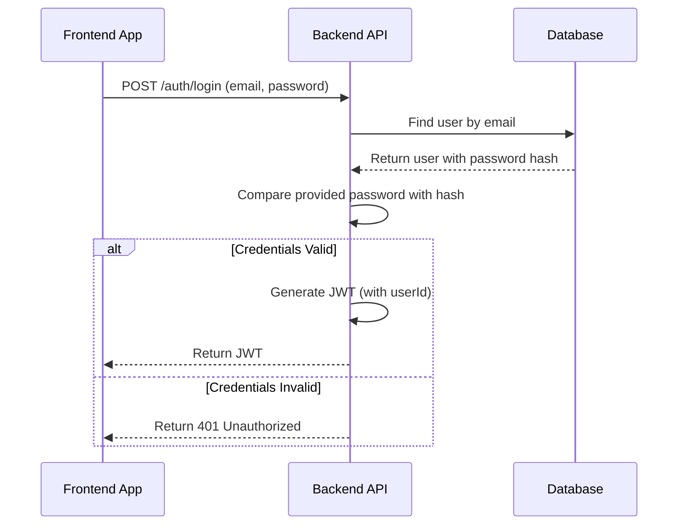

# Backend Architecture

### Service Architecture

#### Controller/Route Organization

```text
src/
└── features/
    ├── auth/
    │   ├── auth.module.ts
    │   ├── auth.controller.ts
    │   └── auth.service.ts
    └── events/
        ├── events.module.ts
        ├── events.controller.ts
        └── events.service.ts
```

#### Controller Template

```typescript
import { Controller, Get, Post, Body, Param } from '@nestjs/common';
import { EventsService } from './events.service';
import { CreateEventDto } from './dto/create-event.dto';

@Controller('events')
export class EventsController {
  constructor(private readonly eventsService: EventsService) {}

  @Post()
  create(@Body() createEventDto: CreateEventDto) {
    return this.eventsService.create(createEventDto);
  }

  @Get(':id')
  findOne(@Param('id') id: string) {
    return this.eventsService.findOne(id);
  }
}
```

### Database Architecture

#### Data Access Layer (Repository Pattern)

```typescript
import { Injectable } from '@nestjs/common';
import { InjectRepository } from '@nestjs/typeorm';
import { Repository } from 'typeorm';
import { User } from './entities/user.entity';
import { CreateUserDto } from './dto/create-user.dto';

@Injectable()
export class UsersService {
  constructor(
    @InjectRepository(User)
    private usersRepository: Repository<User>,
  ) {}

  create(createUserDto: CreateUserDto): Promise<User> {
    const user = this.usersRepository.create(createUserDto);
    // ... hash password before saving
    return this.usersRepository.save(user);
  }

  findOne(id: string): Promise<User | null> {
    return this.usersRepository.findOneBy({ id });
  }
}
```

### Authentication and Authorization

#### Auth Flow (JWT Login)



#### Middleware/Guards (Route Protection)

```typescript
import { Injectable, CanActivate, ExecutionContext } from '@nestjs/common';
import { AuthGuard } from '@nestjs/passport';

@Injectable()
export class JwtAuthGuard extends AuthGuard('jwt') {}
```

-----

