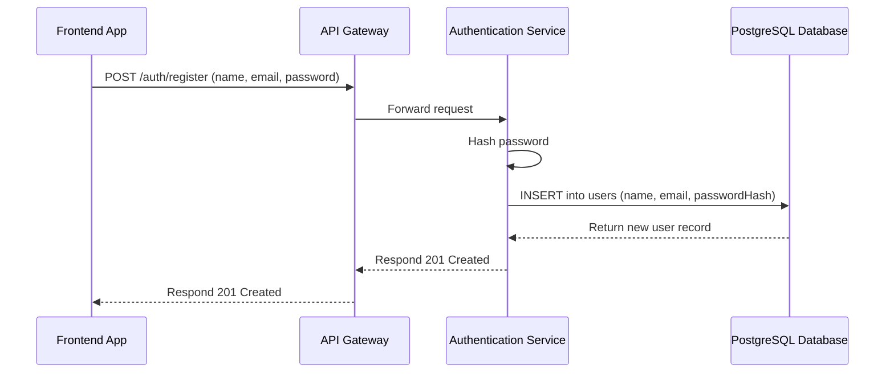
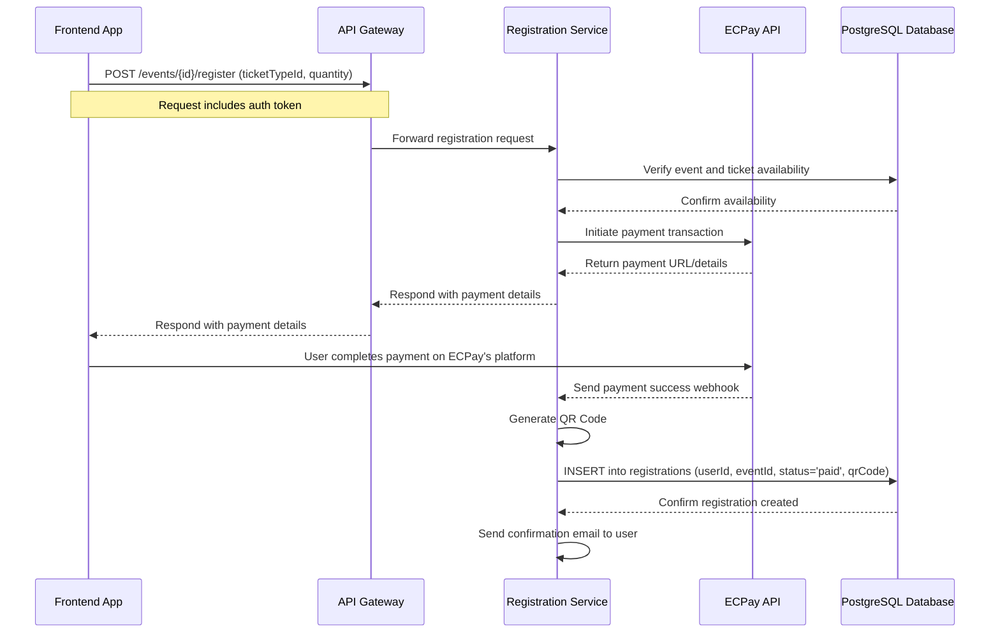

# Core Workflows

### 1\. New User Registration (Email & Password)

```mermaid
sequenceDiagram
    participant FE as Frontend App
    participant APIG as API Gateway
    participant AuthSvc as Authentication Service
    participant DB as PostgreSQL Database

    FE->>APIG: POST /auth/register (name, email, password)
    APIG->>AuthSvc: Forward request
    AuthSvc->>AuthSvc: Hash password
    AuthSvc->>DB: INSERT into users (name, email, passwordHash)
    DB-->>AuthSvc: Return new user record
    AuthSvc-->>APIG: Respond 201 Created
    APIG-->>FE: Respond 201 Created
```

### 2\. Attendee Registers for an Event (Happy Path)

```mermaid
sequenceDiagram
    participant FE as Frontend App
    participant APIG as API Gateway
    participant RegSvc as Registration Service
    participant ECPay as ECPay API
    participant DB as PostgreSQL Database

    FE->>APIG: POST /events/{id}/register (ticketTypeId, quantity)
    Note over FE,APIG: Request includes auth token

    APIG->>RegSvc: Forward registration request
    RegSvc->>DB: Verify event and ticket availability
    DB-->>RegSvc: Confirm availability
    RegSvc->>ECPay: Initiate payment transaction
    ECPay-->>RegSvc: Return payment URL/details
    RegSvc-->>APIG: Respond with payment details
    APIG-->>FE: Respond with payment details

    FE->>ECPay: User completes payment on ECPay's platform
    ECPay-->>RegSvc: Send payment success webhook
    RegSvc->>RegSvc: Generate QR Code
    RegSvc->>DB: INSERT into registrations (userId, eventId, status='paid', qrCode)
    DB-->>RegSvc: Confirm registration created
    RegSvc->>RegSvc: Send confirmation email to user
```

-----

